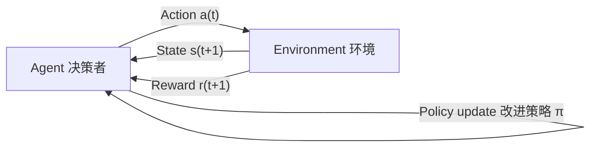

# Agent强化学习训练Agentic RL

# 快速入门实战

[toc]

- 公开课课件领取


## 一、Agentic RL：打造自主学习自主迭代的高性能 Agent

### 1. 工业级 Agent 开发落地难题：成本和效率难以兼顾

​	随着大语言模型（LLM, Large Language Models）和智能 Agent 技术的爆炸性发展，越来越多的企业与研究机构开始探讨：如何将 Agent 技术真正落地到工业场景、在商业化环境中稳定运行？然而，在实际工程实践中，一个非常严峻的挑战不断出现：**成本与效率难以兼顾**。

#### 1.1 强模型＋高性能的现实代价

​	首先，让我们来看“强模型”意味着什么。近年来，诸如DeepSeek、GPT-5、Qwen3等大规模模型在通用能力上表现卓越：语言理解、推理、生成能力非常强，甚至在工具调用、代码生成、数学证明等复杂任务上都有突破。然而，这样的模型在“工业化落地”方面却遇到了两大壁垒：

- **部署成本极高**。大模型通常含数十亿到百亿以上参数，运行时不仅需要大规模显存（如DeepSeek-V3.2模型企业级高并发部署至少需要双节点8卡A100服务器），还需要强大的计算集群、低延迟网络、冷却散热设备，整体基础设施成本极高。此外，每次推理都可能产生较高的 API 调用费用或内部计算资源开销。
- **数据隐私与安全难以保障**。许多行业（例如金融、医疗、政府）对数据安全和隐私要求极高。使用公开云端 API 服务调用强模型意味着将敏感数据发送至外部服务器，存在数据泄露风险。或者，若将强模型部署在内部私有云环境，则意味着企业需要承担更大的硬件投入与维护成本。

结果是：虽然“强模型容器化、自动调用工具”的构想令人兴奋，但落地执行中往往会因为“成本爆表”或“能力配置过剩”而被迫放弃或大幅简化。

#### 1.2 轻量模型＋高效率的工程妥协

​	另一个常见走向是：为降低成本，企业转而选择体量较小、部署更容易、运行更高效的开源模型。例如模型参数只有数 亿或数十亿级别，显存需求较低、推理延迟较短、硬件门槛亦低得多。这种方案确实在“部署难度”“维护成本”“延迟响应”方面表现更佳，但却伴随一个痛点：**能力不足**。具体表现包括：

- 对于复杂任务（尤其是工具调用、跨表 SQL 查询、复杂推理链）表现不佳，生成错误或无法稳定完成任务。
- 在少量数据或定制场景下，模型“泛化能力”较弱，需要大量人工提示（prompt engineering）或微调才能达到合理水平。
- 在实际使用中，为了避免错误，往往不得不对模型输出进行人工校验或报警机制，从而复用了人工成本。

因此，“轻量化部署”虽然降低了工程门槛，但在“真正落地”的过程中，经常被“能力瓶颈”所困。

#### 1.3 垂域模型训练 & SFT：仍然存在挑战

为了在成本与效率之间寻找平衡，不少工程团队尝试了两条技术路径：

- **训练垂域专用模型**：即从头或在通用基础模型上，使用行业特定数据进行大规模训练（如金融对话、法律检索、医学问答）。虽然能够获得较高的专用能力表现，但这一路径的缺点是非常显著：训练成本高、数据准备繁琐、基础设施需求大、调参复杂、维护升级难。
- **SFT（Supervised Fine-Tuning）微调**：在通用模型基础上，用监督方式（将输入-输出对提前准备好）对模型进行微调，令其更贴合特定任务（如文本分类、SQL 生成）。相比从头训练，这种方式成本低许多，部署也更快。但实际落地时发现：当任务涉及到调用工具、执行 SQL、进行自我纠错与多轮交互时，SFT 的提升往往不能满足需求——模型虽然微调过，但仍然缺乏“***自主学习、自主纠错、动态迭代***”的能力。

​	换句话说，虽然垂域训练与 SFT 能够部分改善轻量模型在定制任务上的表现，但仍然难以同时做到“低成本＋高能力＋高效率”。工业界亟需寻找一种“**低门槛部署、可定制功能、动态能力提升**”的技术方案。

#### 1.4 最高效率提升Agent性能：Agent 强化学习（Agentic RL）

​	在此背景下，**Agent 强化学习**（常称 Agentic RL）应运而生，成为了许多工程团队考虑的重要方向。其核心优势在于：

- **快速提升小尺寸模型的工具调用准确率**：通过强化学习方法，模型可通过“生成→执行→反馈”循环，主动提升对工具调用、对话交互、SQL 生成等特定任务的能力。
- **降低训练成本**：相比从头训练或大规模 SFT，强化学习方案往往只需少量 rollout 数据和少量训练资源，就能够显著提升模型能力，尤其在定制场景下效果明显。
- **支持模型持续迭代与优化**：一旦部署后，还可以继续运行 rollout 数据、反馈、再训练，实现“模型上线后还在变强”——这对于工业级 Agent 尤为关键。

因此，Agentic RL 成为了在“成本低、效率高、能力强”三者中取得平衡的关键技术路径。接下来，我们将更深入介绍其概念、原理以及与传统 SFT 的区别。

### 2. Agentic RL 概念介绍

#### 2.1 强化学习（Reinforcement Learning）概念介绍

​	强化学习（Reinforcement Learning，简称 RL）是一类机器学习范式，其核心思想是：智能体（Agent）在环境（Environment）中反复执行动作（Action），通过观察环境状态（State）和获得奖励（Reward）来调整行为策略（Policy），从而在长期运行中最大化累积奖励。其基本要素包括：

- **状态 (State)**：智能体所处环境的当前观测，例如屏幕画面、传感器数据、对话上下文等。
- **动作 (Action)**：智能体在当前状态下可选的行为，例如“生成一条 SQL 语句”、“调用工具”、“提出下一轮问题”等。
- **奖励 (Reward)**：环境给予智能体的反馈信号，用以指示其行为是否有利，例如“生成 SQL 正确”可给 +1 奖励，“出错”给 0 或负奖励。
- **策略 (Policy)**：智能体依据状态选择动作的机制或函数。
- **价值函数 (Value Function)**：衡量在当前状态下、遵循某策略时，未来可获得的累积奖励期望。
- **环境转移 (State Transition)**：智能体执行动作后环境跳转到下一个状态并给出新的奖励。

在对话、生成、Agent 调用工具等任务中，强化学习渐渐被广泛应用，因为它能够学习“一个动作序列导致长期收益”的能力，而不仅仅局限于“一次输出对错”的监督学习。

**强化学习的核心：决策—反馈—改进的闭环**



​	在每个时间步 t，智能体依据状态 s(t) 选动作 a(t)，环境返回新状态 s(t+1) 与奖励 r(t+1)；智能体据此更新策略 π，让自己在未来获得更高的总收益。整个学习过程并不是“先学完再用”，而是**一边行动、一边吃反馈、一边变更好**。


#### 2.2 什么是 Agentic RL？

​	此前我们提到，“Agentic RL”即 Agent 强化学习，是将 RL 方法应用于智能 Agent 系统的特定范式。换句话说，它不仅仅训练一个模型“回答问题”，而是训练一个 Agent “**持续行动＋自我纠错＋迭代提升**”的能力。我们可以给出如下定义：

​	总的来说，**Agentic RL** 是指：在智能 Agent 系统中，通过 RL 方法让 Agent 不断生成动作（如工具调用、对话交互、SQL 执行）、观察反馈、获得奖励，并基于累积经验优化其策略，以实现 Agent 在定制任务中“自主学习、自主迭代”的能力提升。

#### 2.3 Agentic RL 与 SFT（监督微调）的区别

​	为了深入理解 Agentic RL 的特点，我们将其与更传统的 SFT（Supervised Fine-Tuning）方式作对比：

| 项目          | SFT （监督微调）                             | Agentic RL （Agent 强化学习）                        |
| ------------- | -------------------------------------------- | ---------------------------------------------------- |
| 输入/输出形式 | 大量准备好的输入-输出对，例如“问题→正确 SQL” | 生成动作→执行→观察反馈→获得奖励                      |
| 优化目标      | 模型拟合训练集中的答案，对错作为损失函数     | 模型最大化累积奖励，不仅看是否一次正确，更看长期表现 |
| 适用场景      | 生成任务、文本分类、简单交互                 | 多轮对话、工具调用、Agent 行为决策、复杂任务链       |
| 能力提升模式  | 静态：模型微调后能力固定                     | 动态：模型上线后还可继续 rollout 与再训练，形成闭环  |
| 资源成本      | 相对低但效果提升有限                         | 效果显著，但需 rollout 环境、执行反馈、策略优化流程  |

从表格中可以看出，当任务涉及“Agent 行为 + 工具调用 + 多步交互 + 纠错能力”时，传统的 SFT 往往难以取得满意效果。而 Agentic RL 通过“行为-反馈-优化”的闭环，能显著提升 Agent 的性能，尤其是在定制化场景中。而结合我们之前讨论的工业化背景，不难看出Agentic RL 的优势在于：

- 它允许小尺寸模型在低成本部署情况下，通过实时 rollout 与反馈机制逐步提升能力，而不是“一次训练后就固定”。
- 它不仅关注“答案正确”这一静态指标，更关注“行为链是否合理”“工具调用是否有效”“多轮交互是否流畅”，从而训练出真正意义上的 Agent。
- 在部署之后， Agent 还可以继续运行 rollout 、收集数据、再训练，形成「上线 → 使用 → 反馈 → 优化」的持续迭代机制，极大提升工程效率与能力稳定性。

好的，下面是本节 **“3. Agentic RL：时下顶尖 Agent 的标配”** 的课件内容，按照你要求的二级／三级标题格式、中文标题、通俗且具有技术深度的风格编写，字数不少于 2000 字。请你先查看是否满意，如果有修改意见我也可以随时调整。

### 3. Agentic RL：时下顶尖 Agent 的标配

#### 3.1 当前顶尖 Agent 的发展趋势

​	在 2025 年，Agent 技术正迎来快速爆发的阶段。从早年以聊天机器人为主，到如今的“工具调用＋多轮决策＋主动执行”型 Agent，整个行业的关注点有了明显转移：不仅仅是“能答问题”，而且是“能做决策”“能自主行动”“能持续迭代”。在这种背景下，越来越多的顶尖 Agent 项目将 Agentic 强化学习（Agentic RL）作为技术标配，换言之，若一个 Agent 没有主动学习、自我纠错、持续优化的能力，那么它很难称之为“工业级”、“顶尖”或“领先”。

#### 3.2 Agentic RL 在顶尖 Agent 中的体现

​	既然说到“标配”，那我们就来看 Agentic RL 在这些顶尖 Agent 系统中具体是如何体现的。通过具体案例，你会发现，它并不是“加几个强化学习训练”那么简单，而是一整套“代理行为－工具调用－反馈循环－线上迭代”机制。

**GPT-5-Codex**

在 GPT-5-Codex 的说明中，OpenAI 提到其训练流程强调真实编程环境的任务：例如“多文件重构”“运行测试套件”“提交 PR” 等。 也就是说，这款模型并不是仅仅“做一个回答”，而是扮演“编程 Agent”、主动执行“编写代码→运行代码→修正代码→提交代码”这一流程。你将会注意到：

- 它的训练目标是**不仅输出一个答案**，而是“直到任务完成”并由系统验证（例如测试通过）才算成功。
- 它强调**工具调用能力**（如 IDE 接口、版本控制 PR、运行时调试）——这正是 Agentic RL 所强调的“代理行为”部分。
- 它具备**持续优化机制**：在任务执行过程中不断反馈、纠错，从而模型获得迭代提升。

因此，我们可以看到 Agentic RL 在这个系统中的实践：模型是一个“活的代理”，而不是只是“被动回答问题”的聊天机器人。


**Tongyi DeepResearch**

在 Tongyi DeepResearch 的技术报告中，阿里通义明确指出其模型是“特为 Agent 任务训练”的：训练管道包括“ Agentic 持续预训练（agentic continual pre-training）”“冷启动 SFT + on-policy RL 策略” 等。
 具体来说，这款模型适配了如下 Agent 特征：

- 长周期、跨任务的“研究型”代理行为：例如检索、浏览、合并多源知识、自动报告生成。
- 工具调用与交互能力：不仅是文本回答，而是访问 Web、检索知识、生成报告。
- Feedback / Reward 驱动的训练机制：训练中不仅做监督微调，还加入了 RL 机制，使模型能基于执行体验优化策略。

从这两个案例来看，顶尖 Agent 系统倾向于将 Agentic RL 作为关键技术路径，使得模型具备“自主行动＋持续迭代”的能力，而不仅仅是“静态微调”。这就进一步印证了“Agentic RL 是时代标配”这一说法。


除此之外，如ChatGPT-Agent、Cursor 2.0 Composer等等，也无一不是经过Agentic RL的产品。


#### 3.3 Agentic RL为Agent开发带来的真正影响

​	接下来我们来看 Agentic RL 解决了传统 Agent 或 LLM 在工业落地时所面临的几个核心瓶颈。

- 部署能力 vs 持续能力

​	传统 LLM 即便具备强大的通用能力，一启动就被“固定”：你做了监督微调，模型上线，它的能力就是固定的。但工业落地中，能力不是“一次训练就搞定”就足够的。环境变化、工具版本更新、数据分布漂移、用户需求演化都要求 Agent 有“持续优化能力”。而 Agentic RL 恰好提供了这种能力：模型上线后还可以继续采集 rollout 数据、获得反馈、优化策略，从而让 Agent 能力持续提升。

- 工具调用 vs 静态回答

在很多 Agent 场景中，真正难的不是“你问我答”这种静态生成，而是“你让我去做”——例如“调用数据库执行 SQL”、 “访问 Web 检索知识”、 “操作 IDE 生成代码”，这些都属于 Agent 行为。传统 SFT 或简单微调在这方面一般表现有限，因为它无法充分利用“执行结果＋反馈”的闭环信息。 Agentic RL 正是为这种“执行－反馈”机制设计，使模型不仅“能答”，而且“能做、做得对”。

- 效率 vs 成本 vs 定制能力

​	通用大模型强但成本高，小模型便宜但能力弱。那怎样才能在部署门槛低、运维难度小的情况下，仍然让 Agent 具备较强能力？答案就是：使用小模型＋强化学习优化其工具调用与任务策略，从而打造“低成本但高能力”的定制 Agent。也就是说， Agentic RL 可被视为“以较低资源获得近顶尖能力”的技术路径。

​	因此，如果一个 Agent 系统仅用了普通 SFT 或固定微调而没有“执行／反馈／迭代”的机制，那么它往往缺乏“持续进化”和“复杂任务自适应”的能力，很难称为真正工业级、顶尖的 Agent。

### 4.热门Agentic RL训练框架

#### 4.1 Hugging Face TRL：LLM 强化学习的工业标准

**GitHub**： https://github.com/huggingface/trl


**定位**：
	Hugging Face TRL（Transformer Reinforcement Learning）是全球最成熟的 LLM RL 开源框架，几乎所有 RLHF 研究与论文（包括 OpenAI DPO、Anthropic HH 模型）都可在 TRL 上复现。其设计目标是将强化学习与 🤗 Transformers 生态无缝结合，为模型提供从 SFT → Reward Model → PPO/DPO 优化的全流程工具链。

**核心功能**：
	TRL 支持 PPO、DPO、KTO、RLOO 等策略优化算法，允许用户基于任何 CausalLM 模型进行强化学习。框架提供 `AutoModelForCausalLMWithValueHead` 模块，用于在语言模型上附加价值头（Value Head），实现对每个生成序列的回报估计。此外，它内置 RLHF 示例管线，从奖励模型训练到 PPO 微调都可一键执行。

**技术特点与用途**：
	TRL 在研究界被视为“RLHF 基线框架”。它支持高度模块化实验配置，可自由替换奖励模型、参考模型和优化算法。其训练稳定性高、社区活跃度高，非常适合科研实验和企业级 LLM 强化学习任务。

#### 4.2 veRL：字节跳动的生产级强化学习框架

**GitHub**： https://github.com/volcengine/verl


**定位**：
	veRL（Volcano Engine Reinforcement Learning）是字节跳动火山引擎于 2024 年底开源的分布式大模型强化学习训练框架。其设计目标是将 RLHF 的科研实现转化为可规模化部署的生产级系统。

**核心功能**：
	veRL 的核心模块包括 Rollout 生成器、奖励建模器、策略更新器、分布式调度器。它支持多种算法，如 PPO、DPO、DAPO （Dynamic Alignment Policy Optimization）和 GRPO，并通过异步管线方式加速训练。其架构借鉴了工业级 RL 系统（如 DeepMind Acme、OpenAI RLHF pipeline），可在数百张 GPU 上同时运行。

**技术特点与用途**：
	veRL 面向企业和研究机构的“大规模模型后训练”场景。其分布式框架支持任务并行、异步更新和奖励缓存机制，可显著降低 GPU 闲置率。其 DAPO 算法被广泛用于 Qwen 系列模型中，以优化推理稳定性与语言一致性。

#### 4.3 ART（Agent Reinforcement Trainer）：智能体行为优化框架

**GitHub**： https://github.com/OpenPipe/ART


**定位**：
	ART 是由 OpenPipe 团队在 2025 年推出的开源框架，专门面向 Agent 场景下的强化学习训练。它让语言模型在动态环境中执行任务、收集交互轨迹、基于反馈优化策略，是“从 LLM 到 Agentic RL” 转变的典型代表。

**核心功能**：
	ART 以 POMDP （部分可观测马尔可夫决策过程）为基础建模 Agent 行为，支持 GRPO 与 RLVR 等算法。其训练循环可连接外部工具（如 Web API、文件系统、浏览器模拟器等），让模型学会在真实任务中优化执行策略。

**用途与特点**：
	ART 特别适用于构建“会操作”的 Agent，例如 Web 浏览 Agent、代码调试 Agent 或信息抽取 Agent。与 TRL 不同，ART 关注模型的执行反馈而非文本对齐。其可插拔 environment 接口允许用户轻松定义任务环境，使 Agent 在执行任务时获得奖励信号，从而实现端到端强化学习。

#### 4.4 Microsoft Agent-Lightning：企业级 Agentic RL 平台

**GitHub**： https://github.com/microsoft/agent-lightning


**定位**：
	Agent-Lightning 是微软在 2025 年推出的多智能体强化学习框架，旨在为企业提供一个统一的 Agent 训练与评估平台。其灵感来自 PyTorch Lightning 的模块化设计，能够在不同 Agent 系统（如 LangChain、AutoGen、Swarm 等）上无缝嵌入 RL 训练机制。

**核心功能**：
	框架核心由 Trainer、Rewarder、Environment 和 Orchestrator 模块构成。支持 PPO、DPO、RLVR 等算法，可在多 Agent 协作任务中共享奖励信号，实现自适应优化。它还内置 MCP 协议（Model Context Protocol）接口，方便连接外部 LLM 服务进行协同训练。

**技术特点与用途**：
	Agent-Lightning 为“多智能体系统的强化学习训练”提供工业级解决方案。它能在任务自动化、AI 编程助理、搜索规划等场景中实现多 Agent 间的动态协作优化，支持自动奖励归因与可视化分析。

- 公开课课件领取


## 二、微软Agent-Lightning快速入门介绍

### 1. 端到端Agentic RL解决方案：Agent-Lightning

​	Agent Lightning 是一个用于训练和优化 AI 智能体的框架，它采用强化学习、自动提示优化、监督式微调和其他算法。本页面概述了该系统的架构、核心概念和主要工作流程。


​	Agent Lightning 通过检测智能体交互、收集遥测数据并应用学习算法来改进智能体行为，从而以最小的代码更改实现 AI 智能体的优化。该系统支持多种智能体框架（LangChain、OpenAI Agent SDK、AutoGen、CrewAI、Anthropic）和各种优化算法（RL、APO、SFT）。

主要特点：

| 特征           | 描述                                   |
| -------------- | -------------------------------------- |
| **与框架无关** | 通过通用工具与任何代理框架配合使用     |
| **最小侵入**   | 几乎不需要对现有代理进行任何代码更改。 |
| **灵活部署**   | 支持单进程、多进程和分布式执行         |
| **算法多样性** | 包括 RL、APO、SFT 和自定义算法支持     |
| **生产就绪**   | 全面的 CI/CD、测试和部署基础设施       |


Agent Lightning软件包由多个核心模块组成，分别处理训练和优化工作流程的不同方面。


同时，Agent Lightning 采用解耦架构，其中`LightningStore`充当中央消息队列和数据库，协调算法和运行器之间的通信。


而在实际运行过程中，Agent核心训练循环遵循生产者-消费者（producer-consumer）模式，其中算法生成任务，而跑者则消费这些任务：


### 2.基于LangGraph的SQL-Agent强化学习微调流程

#### 2.1 整体架构概述：运行与训练的分离机制

​	在进行 Agent 的强化学习微调之前，我们首先需要理解这一项目的整体架构。整个系统采用了**“运行与训练分离”**的设计思想，也就是将 Agent 的实际执行逻辑（即如何生成、执行与修正 SQL 语句）与强化学习训练过程（即如何计算奖励、更新模型参数）进行解耦。这种架构的设计灵感来源于工业级 RLHF（Reinforcement Learning from Human Feedback）系统：一部分负责与环境交互，另一部分负责模型优化，从而实现可扩展、可维护的训练流程。

具体而言，系统分为两大核心模块：

1. **运行模块（Agent 运行脚本）**：
    该部分由 LangGraph 构建的 SQL-Agent 负责，实现从自然语言问题到 SQL 执行结果的完整推理流程。此模块重点在于如何让 Agent 具备可观测、可追踪的行为，从而为后续强化学习提供高质量的数据轨迹。
2. **训练模块（Agent 训练脚本）**：
    这一部分主要依托 Agent-Lightning 框架与 veRL （Volcengine Reinforcement Learning） 训练系统完成。其作用是利用运行模块产生的行为轨迹，对底层基座模型进行基于 GRPO （Group Relative Policy Optimization） 算法的优化，从而实现策略提升与能力迁移。


通过这种结构，系统实现了“**前端执行、后端优化、双向联动**”的设计。
	运行模块专注于生成和记录，训练模块专注于分析与更新，两者之间通过轨迹数据（trajectory）和奖励信号（reward signal）进行衔接。换言之，**运行脚本产出数据，训练脚本消化数据**。

#### 2.2 运行模块：LangGraph Agent 的设计逻辑

​	LangGraph 是 LangChain 1.0 之后推出的新型工作流图框架，用于将复杂的 Agent 推理过程可视化、结构化。在本项目中，LangGraph 承担着整个 SQL Agent 的“行为控制”职责。其核心思想是：**将 Agent 的推理过程抽象为一张有向图（Directed Graph）**，每一个节点代表 Agent 的一个关键步骤，而节点之间的边则代表决策路径或执行顺序。

在 SQL Agent 中，LangGraph 的节点主要包括：

- **write_query（生成 SQL 语句）**：模型根据输入的问题及数据库模式（schema）生成初步 SQL 查询；
- **execute_query（执行 SQL）**：调用 SQL 执行工具 (QuerySQLDatabaseTool) 在数据库上运行查询；
- **check_query（检查 SQL 正确性）**：模型根据执行结果判断 SQL 是否合理；
- **rewrite_query（重写 SQL）**：若上一步判断为错误，则重新生成更合理的 SQL；
- **END（结束节点）**：当 Agent 确认 SQL 无误时，停止流程。

​	这种设计使 Agent 在一次运行中可能经历多个“生成-执行-反馈”循环，从而体现出“自我纠错”的特征。更重要的是，LangGraph 天然支持**状态持久化与轨迹记录**，这为强化学习提供了重要基础。每一次执行、判断与重写都会被记录为一条“状态-动作-反馈”数据，这正是强化学习算法所需要的经验数据（Experience Trajectory）。

因此，运行模块的核心目标不仅是“让 Agent 能跑起来”，更重要的是“让 Agent 的行为能被捕获、能被度量、能被优化”。


#### 2.3 Agent-Lightning的封装逻辑

​	在原始的 LangGraph 系统中， Agent 虽然能运行，但无法直接与强化学习训练框架交互。为此， Agent-Lightning 框架在运行脚本上进行了“封装”操作，使得 LangGraph Agent 具备了强化学习所需的接口与记录能力。这种封装的主要目的有三点：

1. **轨迹采集（Trajectory Collection）**：
    Agent-Lightning 在每次 Agent 执行过程中自动记录输入问题、生成的 SQL、执行结果、反馈内容及执行日志。这些轨迹数据被打包成 rollout 样本，供后续 RL 算法使用。
2. **奖励信号传递（Reward Propagation）**：
    运行脚本在每次 Agent 完成一个任务后，会调用 evaluate_query 函数对结果进行评分。若生成的 SQL 与标准答案一致（或执行结果正确），则 reward = 1；否则 reward = 0。这一奖励信号是 GRPO 算法计算梯度的重要依据。
3. **可扩展接口（Training Interface）**：
    Agent-Lightning 在运行层面提供了标准化接口，使得训练模块可以直接通过 rollout 调用 Agent 执行。例如，在 train 脚本中可以统一调用 agent.rollout(task, resources, rollout) 而不必关心 Agent 内部结构。这种解耦式设计使整个系统具有极强的可扩展性，可以轻松替换 Agent 或模型。

​	总结来说， Agent-Lightning 的封装使 LangGraph Agent 从一个“执行体”转变为一个“可训练体”，从而真正具备了强化学习的可操作性。它相当于为 Agent 加上了一层“可观测外壳”，把原本封闭的推理过程开放为可追踪的训练数据流。


#### 2.4 训练模块：基于 veRL 的 GRPO 强化学习逻辑

​	训练模块是整个系统的优化核心，其主要任务是根据 Agent 执行产生的轨迹与奖励，更新底层语言模型参数，使其行为策略（policy）趋向于生成更优的 SQL 语句。

​	veRL （Volcengine Reinforcement Learning） 是由 字节跳动 开源的强化学习训练框架，支持多种算法，包括 PPO、DPO、GRPO 等。其中 **GRPO（Group Relative Policy Optimization）** 是 DeepSeek 提出的一种改进型策略优化算法，能够在无需 critic 网络的情况下实现高效的策略更新，特别适合大语言模型（LLM）的 RL 训练。

在本项目中， train 脚本主要通过 veRL 调用 GRPO 算法来实现训练，其底层逻辑如下：

1. **Rollout 阶段**：
    训练器（Trainer） 会调度多个并行进程，每个进程加载一个 LangGraph Agent 实例，并分配不同的训练样本（自然语言问题）。每个 Agent 根据当前模型策略生成 SQL 、执行、反馈，形成 rollout 轨迹。
2. **Reward 计算**：
    训练器调用 evaluate_query 对每个 Agent 的输出进行评分。若执行结果正确，则给出正向奖励，否则为 0。所有样本的 reward 值将与模型生成的 log prob 概率一同送入 GRPO 优化器。
3. **Advantage 估计与策略更新**：
    GRPO 算法根据组内样本的相对表现计算 advantage（优势函数），不依赖额外 critic 网络。表现较优的样本获得更大权重，劣质样本权重降低，从而实现“优胜劣汰”的参数更新。
4. **参数同步与保存**：
    训练器更新模型参数后，会定期保存检查点（checkpoint），供下一轮 rollout 使用。新参数会替换旧参数，使下一轮 Agent 行为更优。

整个过程形成一个典型的 on-policy 强化学习闭环：**执行 → 反馈 → 优化 → 再执行**，每个循环都会让 Agent 的策略更趋近理想状态。


#### 2.5 运行与训练的闭环：性能提升的路径

​	理解完运行与训练模块后，我们可以从系统层面总结其运行逻辑。整个强化学习微调流程可以用以下闭环描述：

1. LangGraph Agent 根据输入问题生成 SQL；
2. 执行 SQL 并获取执行结果；
3. Agent-Lightning 封装记录轨迹并计算奖励；
4. veRL 收集轨迹与奖励，使用 GRPO 算法更新模型策略；
5. 更新后的模型重新投入下一轮 rollout 执行。

​	在此循环中，每一轮 Agent 的 SQL 生成能力都会得到提升。初期 Agent 可能频繁生成错误 SQL，经过数轮优化后，模型逐渐学会识别正确的字段、表结构和查询模式，生成更符合语义的 SQL 语句。这就是 Agentic RL 的强大之处——通过实际执行结果指导模型学习，使其具备真实世界任务的自适应能力。


​	更进一步，该架构的解耦特性意味着它并不局限于 SQL 任务。理论上，只要 LangGraph 定义了 Agent 的执行流程， Agent-Lightning 提供了 rollout 封装， veRL 即可用于强化学习训练。这为其他类型 Agent 的迁移与再利用提供了极高的灵活性。

### 3. SQL Agent 强化学习训练核心价值分析

#### 3.1 从 SFT 到 Agentic RL：性能提升的逻辑

​	传统 SFT （监督微调）通过输入-输出对来优化模型，使模型在训练集上尽量拟合标准答案。然而，这种方式本质上仍是一种“静态模仿学习”——模型只能模仿训练数据的答案，而无法理解“行为-反馈”的动态关系。对于 SQL 任务而言，这种训练方式存在两个明显局限：一是**泛化能力弱**，模型面对新表结构、新字段命名时容易失败；二是**错误无法自修复**，生成错误 SQL 后无法从执行反馈中学习。

​	而 Agentic RL 正是针对这些局限提出的解决方案。它通过 Agent 的交互式运行过程采集轨迹数据，让模型直接从执行结果中获得学习信号，形成一个闭环学习过程。换言之，模型不再仅仅模仿“标准答案”，而是学习“如何获得正确结果”。

​	例如，在 SQL Agent 训练中，模型通过 LangGraph 循环执行生成 SQL → 执行 → 检查 → 重写，如果生成错误，它会通过奖励函数获得负反馈；若生成正确，奖励函数给予正反馈。多轮训练后，模型的参数逐步偏向于能带来正反馈的输出模式，从而实现策略优化。这种学习方式不仅能快速提升模型的任务准确率，还能显著增强其**泛化能力**——即便遇到从未见过的表结构或字段，也能推测出合理的查询逻辑。

#### 3.2 动态学习机制的价值：比 SFT 更贴近 Agent 真实需求

​	在 Agent 任务中，模型的核心价值不再是“回答正确”，而是“完成任务”。而 Agentic RL 的动态学习机制恰好符合这一逻辑。它通过执行与反馈的循环，让 Agent 逐渐学习如何在复杂任务链中实现目标。例如在 SQL 任务中，不仅是生成 SQL 语句，还要能根据执行结果自动修正。相比之下， SFT 的监督信号只能告诉模型“这个问题对应这个 SQL”，而不能指导它“如何从错误中改正”。

此外，强化学习还允许我们自定义奖励函数，使模型优化目标更加贴合业务。例如：

- 奖励 = SQL 执行无错误 ＋ 查询结果与期望结果一致；
- 对执行速度、资源占用等可附加次级奖励。

这种灵活性使得 Agent 的优化目标不再局限于准确率，而是可以扩展到效率、稳健性、鲁棒性等更高层次指标，从而更好地满足工业落地需求。

#### 3.3 拓展应用：从 SQL 到多工具 Agent 的通用化训练方法

​	强化学习的最大魅力在于其**可迁移性**。虽然本项目以 SQL Agent 为例，但相同的训练架构与思想完全可以迁移到其他 Agent 类型中。只需替换 LangGraph 中的执行节点与奖励函数， Agent-Lightning 和 veRL 的训练逻辑即可复用。例如：

- **数据分析 Agent**：替换 SQL 执行节点为 Python 代码执行环境，根据结果正确性给予奖励。
- **检索问答 Agent**：替换执行节点为搜索引擎调用，奖励依据检索结果相关性。
- **多模态 Agent**：在 LangGraph 中增加图像识别、OCR 或语音识别节点，奖励依据跨模态匹配精度。

这种灵活性使 Agentic RL 成为一种**通用 Agent 训练范式**。
	只要定义清楚任务流程、可执行环境和奖励函数，就可以通过 Agent-Lightning ＋ veRL 的组合完成端到端强化学习训练。这对于企业构建定制化 Agent 生态具有重要意义：不同任务、不同工具集的 Agent 都能共享同一套训练体系，从而显著降低系统开发与维护成本。

#### 3.4 性能与泛化的双重提升

​	实践表明，采用 Agentic RL 训练的 SQL Agent 在多个维度上优于 SFT 模型。首先，在**准确率**方面，由于模型直接从执行反馈中学习，错误样本得到更多反向优化机会，准确率提升显著；其次，在**泛化性**方面，模型通过探索-反馈机制习得了任务底层规律，而非死记数据样本，因此面对新环境时依然具备较强适应能力。

​	例如，DeepSeek 团队在其 R1 项目中报告过类似现象：强化学习阶段让模型从“生成错误”中不断反思、修正，从而实现跨任务迁移能力；同理， SQL Agent 在 GRPO 训练中也能学会“如何构造正确 SQL 而非记住答案”，这正是泛化能力提升的根本原因。

​	换句话说， Agentic RL 训练出的 Agent 不仅在训练数据上表现更好，更重要的是在未知任务上更稳定、更聪明。这种差异在工业应用中价值巨大。

- 公开课课件领取


## 三、基于Agent-Lightning的SQL Agent强化学习训练实战

### 1. 基础环境配置与相关库安装

- 实验环境说明：本小结实验在Ubuntu 22.04、H800（80G）显卡服务器上运行，推荐使用CUDA 12.8，完整运行需要12个小时，如采用LoRA微调，则可以压缩至2小时完成。

- 创建基础虚拟环境

```bash
conda create --name al python=3.12
conda init
conda activate al
# conda install jupyterlab
# conda install ipykernel
# python -m ipykernel install --user --name al --display-name "Python al"
```

- 安装Agent Lightning库

```bash
pip install --upgrade agentlightning
```


- 安装SQL-Agent强化学习训练基础库

```bash
# 注意需要安装openai 2.0以上版本，可以通过pip show openai进行版本查看
pip install openai
pip install agentlightning[apo]

# 注意需要CUDA 12.8版本
pip install torch==2.8.0 torchvision==0.23.0 --index-url https://mirrors.huaweicloud.com/repository/pypi/simple

pip install flash-attn --no-build-isolation

pip install vllm==0.10.2 --index-url https://mirrors.huaweicloud.com/repository/pypi/simple

pip install verl==0.5.0 --index-url https://mirrors.huaweicloud.com/repository/pypi/simple

# 手动完成verl安装后可以输入如下命令进行验证
# pip install agentlightning[verl]
```


- 安装SQL Agent基础库

```bash
pip install "langgraph<1.0" "langchain[openai]<1.0" "langchain-community" "langchain-text-splitters<1.0" "sqlparse" "nltk" --index-url https://mirrors.huaweicloud.com/repository/pypi/simple
```


- Qwen 2.5 coder模型下载：https://www.modelscope.cn/models/Qwen/Qwen2.5-Coder-1.5B-Instruct


```bash
pip install modelscope
```

```bash
# cd /root/autodl-tmp

mkdir ./qwen2.5-Coder

modelscope download --model Qwen/Qwen2.5-Coder-1.5B-Instruct --local_dir ./qwen2.5-Coder
```


- SQL数据集准备

Spider 数据集是一个**大规模跨域文本到SQL数据集**,专门用于训练和评估自然语言到SQL查询的转换能力。这个数据集来自耶鲁大学的研究项目,可以从 [Yale LILY Spider](https://yale-lily.github.io/spider) 官方网站获取.


其中本项目核心要用到的是三个 Parquet 文件:

- **`train_spider.parquet`**: 训练数据集,包含约 8,000 个样本
- **`test_dev_500.parquet`**: 验证数据集的子集,包含 500 个样本
- **`test_dev.parquet`**: 完整的开发/测试数据集

每个 Parquet 文件包含以下字段:
- **`question`**: 自然语言问题(例如:"Show all concert names and their singers")
- **`db_id`**: 数据库标识符(例如:"concert_singer")
- **`query`**: 标准答案 SQL 查询(ground truth)
- **`db_path`**: 数据库文件的相对路径


数据集领取：


总的来说，数据集包含约 **200 个不同的 SQLite 数据库**,每个数据库代表一个特定的业务场景。我们需要这些数据库文件存储在 `data/database/` 目录下,按照数据库名称组织。例如:

- `data/database/concert_singer/concert_singer.db` - 音乐会和歌手数据库
- `data/database/college_2/college_2.db` - 大学信息数据库
- `data/database/flight_2/flight_2.db` - 航班信息数据库

每个数据库都是一个完整的 SQLite 文件,包含多个表和真实的业务数据。需要注意的是，

- Spider 数据集是**跨域**的,意味着它包含多个不同业务领域的数据库,这使得训练出的模型具有更好的泛化能力
- 数据集中的每个问题都有唯一的标准答案 SQL 查询,但可能存在多种等价的 SQL 写法都能得到相同的结果
- SQLite 数据库的使用使得整个系统**零配置**,不需要安装和配置独立的数据库服务器
- 在 CI 测试中,数据集的准备是自动化的，确保了测试环境的一致性

查看数据集：

```bash
# 如果要运行如下代码，建议单独创建环境，以免部分库如numpy版本和agent lightning冲突
pip install -U "pandas==2.2.2" "pyarrow==17.0.0" "fastparquet==2024.5.0" "numpy==1.26.4"
```

然后在Jupyter中运行如下代码，即可查看数据集基本情况：

```python
import pandas as pd

df = pd.read_parquet("train_spider.parquet")

print("共读取样本数：", len(df))

print("字段：", list(df.columns))

print(df.head(3))
```


- wandb安装流程

&emsp;&emsp;在大规模模型训练中，我们往往需要监控和分析大量的训练数据，而WandB可以帮助我们实现这一目标。它提供了以下几个重要的功能：

​	**实时可视化**：WandB可以实时展示训练过程中关键指标的变化，如损失函数、学习率、训练时间等。通过这些可视化数据，我们能够直观地了解模型的训练进展，快速发现训练中的异常或瓶颈。

​	**自动记录与日志管理**：WandB会自动记录每次实验的参数、代码、输出结果，确保实验结果的可追溯性。无论是超参数的设置，还是模型的架构调整，WandB都能够帮助我们完整保留实验记录，方便后期对比与调优。

​	**支持中断与恢复训练**：在长时间的预训练任务中，系统中断或需要暂停是常见的情况。通过WandB的checkpoint功能，我们可以随时恢复训练，从上次中断的地方继续进行，避免数据和时间的浪费。

​	**多实验对比**：当我们尝试不同的模型配置或超参数时，WandB允许我们在多个实验之间轻松进行对比分析，帮助我们选择最优的模型配置。

​	**团队协作**：WandB还支持团队协作，多个成员可以共同查看实验结果，协同调试模型。这对研究和项目开发中团队的合作非常有帮助。

wandb官网：https://wandb.ai/site

<center>

<center>

<center>

<center>

<center>

然后即可在令行中输入如下代码安装wandb：

```bash
pip install wandb
```

<center>

接下来在unsloth微调前，我们即可设置wandb进行微调记录，并可在对应网站上观察到训练过程如下：


### 2.项目创建与运行流程

首先创建基本项目结构如下：

```
SQL-Agent-RL/
├── data/         # 存放数据集
├── model/        # 存放下载的模型权重
└── spider/       # 存放核心脚本
```

`data/`主要放置 Spider 数据集相关文件，包括：

```
train_spider.parquet
test_dev_500.parquet
test_dev.parquet
database/            # 每个数据库一个子目录，内含 .sqlite 和 schema.sql
```


数据集领取：


确保路径与脚本中保持一致，比如在 `train_sql_agent.py` 中的配置：

```python
"train_files": "data/train_spider.parquet",
"val_files": "data/test_dev_500.parquet",
```

以及 SQLAgent 调用时会读取：

```python
original_db_path = os.path.join(self.spider_dir, "database", task["db_id"], task["db_id"] + ".sqlite")
```

所以  `data/database/...` 子目录必须存在，否则训练时会提示数据库路径错误。

 `model/`则是本地下载的模型权重（Qwen2.5-Coder）。 推荐结构如下：

```
model/
└── Qwen2.5-Coder-1.5B-Instruct/
    ├── config.json
    ├── tokenizer.json
    ├── model.safetensors
    └── ...
```

然后在训练脚本 `train_sql_agent.py` 中，把配置改为本地路径：

```python
"actor_rollout_ref": {
    "model": {
        "path": "/root/SQL-Agent-RL/model/Qwen2.5-Coder-1.5B-Instruct",
    },
}
```


这样就不会再联网从 Hugging Face 下载了。


然后 `spider/`则用于存放项目核心代码脚本，建议包含：

```
spider/
├── sql_agent.py          # 基于 LangGraph 的 SQL Agent 封装
├── train_sql_agent.py    # 训练脚本（veRL + Agent-Lightning）
├── spider_eval/          # 官方提供的 SQL 评估函数
│   └── exec_eval.py
│   └── 其他各项py文件
└── __init__.py
```

这种结构可以让 Python 识别 `spider` 作为包路径，避免导入错误（如 `from spider.sql_agent import LitSQLAgent`）。


其中Agent创建代码sql_agent.py解释如下：

````python
# Copyright (c) Microsoft. All rights reserved.

"""Sample code that demonstrates an SQL agent using LangGraph and LangChain,
trainable with Agent-lightning.

Adapted from https://python.langchain.com/docs/tutorials/sql_qa/
as well as https://langchain-ai.github.io/langgraph/tutorials/sql-agent/
"""

from __future__ import annotations

import os
import re
import shutil
import tempfile
import time
from typing import Any, Dict, List, Literal, Optional, cast

import pandas as pd
import termcolor
from langchain.chat_models import init_chat_model
from langchain_community.tools.sql_database.tool import QuerySQLDatabaseTool
from langchain_community.utilities import SQLDatabase
from langchain_core.messages import AnyMessage, BaseMessage, HumanMessage
from langchain_core.prompts import ChatPromptTemplate
from langgraph.graph import END, START, MessagesState, StateGraph
from langgraph.graph.state import CompiledStateGraph
from spider_eval.exec_eval import eval_exec_match

import agentlightning as agl

agl.configure_logger()

logger = agl.configure_logger(name=__name__)


WRITE_QUERY_PROMPT = ChatPromptTemplate(
    [
        (
            "system",
            """
You are an agent designed to interact with a SQL database.
     Given an input question, create a syntactically correct {dialect} query to run to help find the answer.

Pay attention to use only the column names that you can see in the schema description.
Be careful to not query for columns that do not exist.
Also, pay attention to which column is in which table.

## Table Schema ##

Only use the following tables:
{table_info}

## Output Format ##

Respond in the following format:

```{dialect}
GENERATED QUERY
```
""".strip(),
        ),
        ("user", "Question: {input}"),
    ]
)


CHECK_QUERY_PROMPT = ChatPromptTemplate(
    [
        (
            "system",
            """
You are a SQL expert with a strong attention to detail.
Double check the {dialect} query for common mistakes, including:
- Using NOT IN with NULL values
- Using UNION when UNION ALL should have been used
- Using BETWEEN for exclusive ranges
- Data type mismatch in predicates
- Properly quoting identifiers
- Using the correct number of arguments for functions
- Casting to the correct data type
- Using the proper columns for joins
- Explicit query execution failures
- Clearly unreasoable query execution results

## Table Schema ##

{table_info}

## Output Format ##

If any mistakes from the list above are found, list each error clearly.
After listing mistakes (if any), conclude with **ONE** of the following exact phrases in all caps and without surrounding quotes:
- If mistakes are found: `THE QUERY IS INCORRECT.`
- If no mistakes are found: `THE QUERY IS CORRECT.`

DO NOT write the corrected query in the response. You only need to report the mistakes.
""".strip(),
        ),
        (
            "user",
            """Question: {input}

Query:

```{dialect}
{query}
```

Execution result:

```
{execution}
```""",
        ),
    ]
)


REWRITE_QUERY_PROMPT = ChatPromptTemplate(
    [
        (
            "system",
            """
You are an agent designed to interact with a SQL database.
Rewrite the previous {dialect} query to fix errors based on the provided feedback.
The goal is to answer the original question.
Make sure to address all points in the feedback.

Pay attention to use only the column names that you can see in the schema description.
Be careful to not query for columns that do not exist.
Also, pay attention to which column is in which table.

## Table Schema ##

Only use the following tables:
{table_info}

## Output Format ##

Respond in the following format:

```{dialect}
REWRITTEN QUERY
```
""".strip(),
        ),
        (
            "user",
            """Question: {input}

## Previous query ##

```{dialect}
{query}
```

## Previous execution result ##

```
{execution}
```

## Feedback ##

{feedback}

Please rewrite the query to address the feedback.""",
        ),
    ]
)


class State(MessagesState):
    question: str
    query: str
    execution: str
    answer: str
    feedback: str
    num_turns: int
    messages: list[AnyMessage]


class SQLAgent:

    def __init__(
        self,
        db: str,
        max_turns: int = 5,
        debug: bool = False,
        db_schema: str | None = None,
        endpoint: str | None = None,
        verl_replacement: Dict[str, Any] | None = None,
        table_info_truncate: int = 2048,
        execution_truncate: int = 2048,
    ):
        self.db = SQLDatabase.from_uri(db)  # type: ignore
        self.db_schema = db_schema
        self.debug = debug
        self.max_turns = max_turns
        self.table_info_truncate = table_info_truncate
        self.execution_truncate = execution_truncate
        if verl_replacement is not None:
            self.model_name: str = verl_replacement["model"]  # type: ignore
            assert endpoint is not None
            self.llm = init_chat_model(
                self.model_name,
                model_provider="openai",
                openai_api_base=endpoint,
                openai_api_key=os.environ.get("OPENAI_API_KEY", "dummy"),
                temperature=verl_replacement["temperature"],
                max_retries=0,
                max_tokens=2048,
            )
        else:
            self.model_name: str = os.environ.get("MODEL", "gpt-4.1-mini")
            self.llm = init_chat_model(
                self.model_name,
                model_provider="openai",
                openai_api_base=endpoint or os.environ["OPENAI_API_BASE"],
                openai_api_key=os.environ["OPENAI_API_KEY"],
                temperature=0,
                max_retries=1,
                max_tokens=2048,
            )

    def get_table_info(self) -> str:
        """Get the table information in a human-readable format."""
        try:
            table_info = self.db.get_table_info()
            if len(table_info) > self.table_info_truncate:
                table_info = table_info[: self.table_info_truncate] + "\n... (truncated)"
            return table_info
        except Exception as e:
            logger.error(f"Failed to get table info: {e}")
            if self.db_schema:
                if len(self.db_schema) > self.table_info_truncate:
                    return self.db_schema[: self.table_info_truncate] + "\n... (truncated)"
                return self.db_schema
            return "No schema available."

    def invoke_prompt(self, prompt: Any) -> AnyMessage:
        if self.debug:
            for message in prompt.messages:
                termcolor.cprint(message.pretty_repr(), "blue")

        try:
            result = self.llm.invoke(prompt)
        except Exception as e:
            logger.error(f"Failed to invoke prompt: {e}")
            # FIXME: fallback to create a random trajectory
            result = self.llm.invoke([HumanMessage(content="Please create a random SQL query as an example.")])

        if self.debug:
            termcolor.cprint(result.pretty_repr(), "green")

        return result  # type: ignore

    def truncate_execuion(self, execution: str) -> str:
        """Truncate the execution result to a reasonable length."""
        if len(execution) > self.execution_truncate:
            return execution[: self.execution_truncate] + "\n... (truncated)"
        return execution

    def parse_query(self, message: AnyMessage) -> str | None:
        result: str | None = None
        for match in re.finditer(r".*```\w*\n(.*?)\n```.*", message.content, re.DOTALL):  # type: ignore
            result = match.group(1).strip()  # type: ignore
        return result  # type: ignore

    def write_query(self, state: State) -> State:
        """Generate SQL query to fetch information."""
        prompt: Any = WRITE_QUERY_PROMPT.invoke(  # type: ignore
            {
                "dialect": self.db.dialect,
                "input": state["question"],
                "table_info": self.get_table_info(),
            }
        )
        result = self.invoke_prompt(prompt)  # type: ignore

        query = self.parse_query(result) or result.content  # type: ignore

        return {  # type: ignore
            **state,
            "query": query,  # type: ignore
            "num_turns": 1,
            "messages": [*prompt.messages, result],
        }

    def execute_query(self, state: State) -> State:
        """Execute SQL query."""
        execute_query_tool = QuerySQLDatabaseTool(db=self.db)
        execution_result = execute_query_tool.invoke(state["query"])  # type: ignore
        if not isinstance(execution_result, str):
            # Convert to string if it's not already
            execution_result = str(execution_result)
        if self.debug:
            termcolor.cprint(execution_result, "yellow")
        return {**state, "execution": execution_result}

    def check_query(self, state: State) -> State:
        """Check the SQL query for correctness."""
        prompt: Any = CHECK_QUERY_PROMPT.invoke(  # type: ignore
            {
                "dialect": self.db.dialect,
                "input": state["question"],
                "query": state["query"],
                "execution": self.truncate_execuion(state["execution"]),
                "table_info": self.get_table_info(),
            }
        )
        result = self.invoke_prompt(prompt)  # type: ignore

        res = {  # type: ignore
            **state,
            "feedback": result.content,  # type: ignore
            "messages": [*state.get("messages", []), *prompt.messages, result],
        }
        return res  # type: ignore

    def rewrite_query(self, state: State) -> State:
        """Rewrite SQL query if necessary."""
        prompt: Any = REWRITE_QUERY_PROMPT.invoke(  # type: ignore
            {
                "dialect": self.db.dialect,
                "input": state["question"],
                "query": state["query"],
                "execution": self.truncate_execuion(state["execution"]),
                "feedback": state["feedback"],
                "table_info": self.get_table_info(),
            }
        )
        result = self.invoke_prompt(prompt)  # type: ignore

        rewritten_query = self.parse_query(result)  # type: ignore

        return {
            **state,
            "query": rewritten_query or state["query"],
            "num_turns": state.get("num_turns", 0) + 1,
            "messages": [*prompt.messages, result],  # clear previous prompts
        }

    def should_continue(self, state: State) -> Literal[END, "rewrite_query"]:  # type: ignore
        """Determine if the agent should continue based on the result."""
        if state["messages"] and isinstance(state["messages"][-1], BaseMessage):  # type: ignore
            last_message = state["messages"][-1]
            if "THE QUERY IS CORRECT" in last_message.content:  # type: ignore
                if "THE QUERY IS INCORRECT" in last_message.content:  # type: ignore
                    # Both correct and incorrect messages found
                    # See which is the last one
                    correct_index = last_message.content.rfind("THE QUERY IS CORRECT")  # type: ignore
                    incorrect_index = last_message.content.rfind("THE QUERY IS INCORRECT")  # type: ignore
                    if correct_index > incorrect_index:
                        return END
                else:
                    return END

        if state.get("num_turns", 0) >= self.max_turns:
            return END

        return "rewrite_query"

    def graph(self) -> CompiledStateGraph[State]:
        builder = StateGraph(State)
        builder.add_node(self.write_query)  # type: ignore
        builder.add_node(self.execute_query)  # type: ignore
        builder.add_node(self.check_query)  # type: ignore
        builder.add_node(self.rewrite_query)  # type: ignore

        builder.add_edge(START, "write_query")
        builder.add_edge("write_query", "execute_query")
        builder.add_edge("execute_query", "check_query")
        builder.add_conditional_edges(
            "check_query",
            self.should_continue,  # type: ignore
        )
        builder.add_edge("rewrite_query", "execute_query")

        return builder.compile()  # type: ignore


def evaluate_query(query: str, ground_truth: str, database: str, raise_on_error: bool = True) -> float:
    # TODO(yuge): Maybe we can evaluate intermediate queries and assign more precise rewards.

    # included in the original evaluation script
    # query = query.replace("value", "1")

    try:
        database = os.path.abspath(database)
        if not os.path.exists(database):
            raise FileNotFoundError(f"Database file {database} does not exist.")

        # Parameters following the default setting
        exec_score = eval_exec_match(
            db=database,
            p_str=query,
            g_str=ground_truth,
            plug_value=False,
            keep_distinct=False,
            progress_bar_for_each_datapoint=False,
        )
        if exec_score == 1:
            return 1.0
        else:
            return 0.0
    except Exception as e:
        if raise_on_error:
            raise
        else:
            logger.exception(f"Error evaluating query: {e}")
            return 0.0


class LitSQLAgent(agl.LitAgent[Dict[str, Any]]):

    def __init__(
        self,
        trained_agents: Optional[str] = r"write",
        val_temperature: Optional[float] = None,
        max_turns: int = 3,
        table_info_truncate: int = 2048,
        execution_truncate: int = 2048,
    ) -> None:
        super().__init__(trained_agents=trained_agents)
        self.val_temperature = val_temperature
        self.spider_dir = os.environ.get("VERL_SPIDER_DATA_DIR", "data")
        self.max_turns = max_turns
        self.table_info_truncate = table_info_truncate
        self.execution_truncate = execution_truncate

    def rollout(
        self,
        task: Dict[str, Any],
        resources: agl.NamedResources,
        rollout: agl.Rollout,
    ) -> float | None:
        question = task["question"]
        start_time = time.time()
        llm: agl.LLM = cast(agl.LLM, resources["main_llm"])

        if rollout.mode == "train":
            original_db_path = os.path.join(self.spider_dir, "database", task["db_id"], task["db_id"] + ".sqlite")
        else:
            original_db_path = os.path.join(self.spider_dir, "test_database", task["db_id"], task["db_id"] + ".sqlite")
        ground_truth = task["query"]

        if not os.path.exists(original_db_path):
            logger.error(f"Database {original_db_path} does not exist. Skipping.")
            return None

        schema_path = os.path.join(os.path.dirname(original_db_path), "schema.sql")
        if os.path.exists(schema_path):
            with open(schema_path, "r") as f:
                schema = f.read()
        else:
            logger.error("Schema file not found: %s", schema_path)
            schema = "No schema available."

        rollout_id = rollout.rollout_id

        with tempfile.TemporaryDirectory() as temp_dir:
            db_path = os.path.join(temp_dir, os.path.basename(original_db_path))
            shutil.copyfile(original_db_path, db_path)
            logger.info(f"[Rollout {rollout_id}] Question: {question}")
            logger.info(f"[Rollout {rollout_id}] Ground Truth: {ground_truth}")

            # Run the agent
            agent = SQLAgent(
                "sqlite:///" + db_path,
                max_turns=self.max_turns,
                table_info_truncate=self.table_info_truncate,
                execution_truncate=self.execution_truncate,
                debug=False,
                db_schema=schema,
                endpoint=llm.get_base_url(rollout.rollout_id, rollout.attempt.attempt_id),  # type: ignore
                verl_replacement=(
                    {"model": llm.model, **llm.sampling_parameters}
                    if rollout.mode == "train"
                    else {
                        "model": llm.model,
                        "temperature": (
                            self.val_temperature
                            if self.val_temperature is not None
                            else llm.sampling_parameters.get("temperature", 0.0)
                        ),
                    }
                ),
            ).graph()
            try:
                # Required to make the langchain tracing work
                handler = self.tracer.get_langchain_handler()
                result = agent.invoke(  # type: ignore
                    {"question": question},  # type: ignore
                    {"callbacks": [handler] if handler else [], "recursion_limit": 100},
                )
            except Exception as e:
                logger.exception(f"[Rollout {rollout_id}] Error during agent invocation: {e}")
                return

            logger.info(f"[Rollout {rollout_id}] Generated Query: {result['query']}")

        end_time_rollout = time.time()

        with tempfile.TemporaryDirectory() as temp_dir:
            db_path = os.path.join(temp_dir, os.path.basename(original_db_path))
            shutil.copyfile(original_db_path, db_path)

            reward = evaluate_query(result["query"], ground_truth, db_path, raise_on_error=False)
            logger.info("[Rollout %s] Reward: %s", rollout_id, reward)

        end_time_eval = time.time()

        logger.info("[Rollout %s] Time taken for rollout: %.2f seconds", rollout_id, end_time_rollout - start_time)
        logger.info(
            "[Rollout %s] Time taken for evaluation: %.2f seconds", rollout_id, end_time_eval - end_time_rollout
        )

        return reward


def debug_sql_agent():
    spider_dev_data_path = os.path.join(os.environ.get("VERL_SPIDER_DATA_DIR", "data"), "dev.parquet")
    if not os.path.exists(spider_dev_data_path):
        raise FileNotFoundError(f"Spider dev data file {spider_dev_data_path} does not exist.")
    df = pd.read_parquet(spider_dev_data_path).head(10)  # type: ignore
    df = cast(List[Dict[str, Any]], df.to_dict(orient="records"))  # type: ignore
    print("Debug data:", df)

    trainer = agl.Trainer(
        n_workers=1,
        initial_resources={
            "main_llm": agl.LLM(
                endpoint=os.environ["OPENAI_API_BASE"],
                model="gpt-4.1-nano",
                sampling_parameters={"temperature": 0.7},
            )
        },
    )
    trainer.dev(LitSQLAgent(), df)


if __name__ == "__main__":
    debug_sql_agent()
````

解释如下

```python
class SQLAgent:
    def __init__(self, db: str, max_turns: int = 5, debug: bool = False, ...):
        self.db = SQLDatabase.from_uri(db)
        ...
        self.llm = init_chat_model(...)
```

**说明：**
 `SQLAgent` 是整个智能体的主体类。
 在初始化时：

- 建立数据库连接（基于 `SQLDatabase`）。
- 初始化大语言模型（LLM），支持直接连接 OpenAI 或通过 Agent-Lightning 提供的虚拟接口。
- 支持设置最大循环次数 `max_turns`，以及调试模式、表结构截断长度等。

```python
def get_table_info(self) -> str:
    try:
        table_info = self.db.get_table_info()
        ...
```

**说明：**
 用于提取数据库的表结构描述。

- 优先调用 LangChain 的 `get_table_info()`；
- 若失败，则使用传入的 `db_schema`；
- 超过长度则进行截断，防止 Prompt 太长。

```python
def invoke_prompt(self, prompt: Any) -> AnyMessage:
    result = self.llm.invoke(prompt)
    return result
```

**说明：**
 这是所有 Prompt 调用的统一入口。

- 调用大模型生成回复；
- 在调试模式下会以彩色打印 Prompt 和回复；
- 若出现错误，会调用备用提示生成随机 SQL 以防中断。

```python
def parse_query(self, message: AnyMessage) -> str | None:
    for match in re.finditer(r".*```\w*\n(.*?)\n```.*", message.content, re.DOTALL):
        result = match.group(1).strip()
    return result
```

**说明：**
 从模型回复的文本中提取 SQL。

- 使用正则表达式查找 ``` 代码块内的内容。
- 提取最后一个代码块的内容作为 SQL 返回。

```python
def write_query(self, state: State) -> State:
    prompt = WRITE_QUERY_PROMPT.invoke({...})
    result = self.invoke_prompt(prompt)
    query = self.parse_query(result)
    return {...}
```

**说明：**
 这是第一个图节点，用于生成 SQL。

- 根据输入问题和表结构生成 SQL。
- 解析结果后更新 `state`，包括生成的 SQL 和消息记录。

```python
def execute_query(self, state: State) -> State:
    execute_query_tool = QuerySQLDatabaseTool(db=self.db)
    execution_result = execute_query_tool.invoke(state["query"])
    return {**state, "execution": execution_result}
```

**说明：**
 执行生成的 SQL。

- 使用 LangChain 提供的数据库查询工具。
- 将查询结果（或错误信息）记录在 `execution` 字段中。

```python
def check_query(self, state: State) -> State:
    prompt = CHECK_QUERY_PROMPT.invoke({...})
    result = self.invoke_prompt(prompt)
    return {...}
```

**说明：**
 让模型扮演 SQL 检查专家，验证查询是否合理。

- 提供问题、SQL、执行结果和表结构作为输入。
- 模型输出错误说明，并以固定句式结尾。
- 结果被存入 `feedback`，供下一步使用。

```python
def rewrite_query(self, state: State) -> State:
    prompt = REWRITE_QUERY_PROMPT.invoke({...})
    result = self.invoke_prompt(prompt)
    rewritten_query = self.parse_query(result)
    return {...}
```

**说明：**
 当上一步检查出错误时，进入该节点。

- 模型根据反馈修改 SQL。
- 解析后更新 `state`，并将回合数 `num_turns + 1`。

```python
def should_continue(self, state: State) -> Literal[END, "rewrite_query"]:
    if "THE QUERY IS CORRECT" in last_message.content:
        return END
    if state.get("num_turns", 0) >= self.max_turns:
        return END
    return "rewrite_query"
```

**说明：**
 该函数控制循环逻辑：

- 如果模型认为 SQL 正确，结束流程；
- 若达到最大修正次数，也结束；
- 否则返回 `"rewrite_query"` 节点，继续修正。

```python
def graph(self) -> CompiledStateGraph[State]:
    builder = StateGraph(State)
    builder.add_node(self.write_query)
    builder.add_node(self.execute_query)
    builder.add_node(self.check_query)
    builder.add_node(self.rewrite_query)
    ...
    return builder.compile()
```

**说明：**
 在这里定义整个 LangGraph 流程：

1. 添加各个节点；
2. 建立节点之间的执行顺序；
3. 指定条件跳转逻辑（`check_query` → `rewrite_query` 或 `END`）。
    最终返回一个可执行的图。

```python
def evaluate_query(query, ground_truth, database, raise_on_error=True) -> float:
    exec_score = eval_exec_match(...)
    return 1.0 if exec_score == 1 else 0.0
```

**说明：**
 比较生成的 SQL 与标准答案在数据库中的执行结果是否一致。

- 若完全匹配，则得分 1；否则 0。
- 用于强化学习中的奖励计算。

```python
class LitSQLAgent(agl.LitAgent[Dict[str, Any]]):
    def rollout(self, task, resources, rollout) -> float | None:
        ...
```

**说明：**
 `LitSQLAgent` 将 `SQLAgent` 封装为可训练单元，用于 Agent-Lightning 框架。
 主要职责：

- 从 Spider 数据集中取出问题与数据库；
- 创建临时数据库副本；
- 运行 SQLAgent 的 LangGraph；
- 最终评测生成的 SQL 并返回奖励分数。

```python
def debug_sql_agent():
    spider_dev_data_path = os.path.join(os.environ.get("VERL_SPIDER_DATA_DIR", "data"), "dev.parquet")
    df = pd.read_parquet(spider_dev_data_path).head(10)
    trainer = agl.Trainer(...)
    trainer.dev(LitSQLAgent(), df)
```

**说明：**
 这是一个调试入口。

- 读取 Spider 的样例数据；
- 构造一个最小的 Agent-Lightning 训练器；
- 运行 10 条数据，验证 SQLAgent 的功能。


而train_sql_agent.py代码则与我们前面讲解的 `sql_agent.py` 是“前后联动”的：

- `sql_agent.py` 负责定义一个可运行的 **SQL Agent 图（LangGraph 流程）**。
- `train_sql_agent.py` 则负责将这个 Agent 放入 **强化学习算法（VERL 框架）** 中进行训练。

具体解释如下：

```python
# Copyright (c) Microsoft. All rights reserved.

"""Train an SQL agent on the Spider dataset using Agent-lightning.

This module provides a training script for SQL agents using different model configurations.
The script supports three different training configurations:

1. 'fast' - A lightweight configuration optimized for CI testing with reduced epochs
2. 'qwen' - Standard configuration using Qwen-2.5-Coder-1.5B-Instruct model
3. 'llama' - Configuration using LLaMA-3.2-1B-Instruct model with JSON formatting
"""
```

**说明：**
 这部分文档字符串（Docstring）简要说明了脚本的用途与支持的三种训练模式：

| 模式名称 | 说明                                              |
| -------- | ------------------------------------------------- |
| `fast`   | 快速测试模式，用于 CI 测试，训练步数极少          |
| `qwen`   | 使用 Qwen 2.5 Coder 1.5B 模型的标准训练配置       |
| `llama`  | 使用 LLaMA 3.2 1B 模型的训练配置（JSON 格式输出） |

脚本主要用于在 Spider 文本到 SQL 数据集上，通过 Agent-Lightning 框架执行强化学习训练。

```python
from __future__ import annotations
import argparse, os
from copy import deepcopy
from datetime import datetime
from typing import Any, Dict, Optional
import pandas as pd
from sql_agent import LitSQLAgent
import agentlightning as agl
```

**说明：**

- `argparse`：用于解析命令行参数（如选择 fast/qwen/llama 模式）。
- `deepcopy`：用于深拷贝默认配置，避免修改原始模板。
- `pandas`：读取 Spider 数据集（存储为 `.parquet` 文件）。
- `LitSQLAgent`：从前面的 `sql_agent.py` 导入的类，是被训练的智能体。
- `agentlightning`（简称 AGL）：微软的强化学习训练框架，封装了算法与分布式训练逻辑。

```python
RL_TRAINING_CONFIG: Dict[str, Any] = {
    "algorithm": {
        "adv_estimator": "grpo",
        "use_kl_in_reward": False,
    },
    ...
}
```

**说明：**
 这是一个全局字典，定义了强化学习训练的**默认参数模板**，分为以下几部分👇

3.1 算法配置 (`algorithm`)

```python
"algorithm": {
    "adv_estimator": "grpo",
    "use_kl_in_reward": False,
},
```

- `adv_estimator: grpo` 表示使用 **GRPO（Generalized Recurrent Policy Optimization）** 算法。
   这是微软提出的一种类似 PPO 的改进算法，更适合语言模型类任务。
- `use_kl_in_reward=False` 表示不在奖励中显式引入 KL 正则项（更自由的策略更新）。

3.2 数据配置 (`data`)

```python
"data": {
    "train_files": "data/train_spider.parquet",
    "val_files": "data/test_dev_500.parquet",
    "train_batch_size": 32,
    "max_prompt_length": 4096,
    "max_response_length": 2048,
    "truncation": "error",
},
```

这部分指定了训练与验证数据路径，以及输入输出的最大长度约束。

- Spider 数据集以 `.parquet` 格式保存，包含自然语言问题与对应 SQL。
- `max_prompt_length` 与 `max_response_length` 控制上下文长度。
- `truncation="error"` 表示当超出长度时直接报错。

3.3 模型与并行配置 (`actor_rollout_ref`)

这一节定义了三个角色：

- `rollout`：生成经验（即执行 agent，产生数据）；
- `actor`：负责策略优化（即更新模型参数）；
- `ref`：参考模型（稳定更新、提供 baseline）。

同时，还定义了底层使用的模型路径与推理引擎。

```python
"actor_rollout_ref": {
    "rollout": {
        "tensor_model_parallel_size": 1,
        "n": 4,
        "log_prob_micro_batch_size_per_gpu": 4,
        "multi_turn": {"format": "hermes"},
        "name": "vllm",
        "gpu_memory_utilization": 0.8,
        "engine_kwargs": {
            "vllm": {
                "enable_auto_tool_choice": True,
                "tool_call_parser": "hermes",
            }
        },
    },
    "actor": {
        "ppo_mini_batch_size": 32,
        ...
    },
    "ref": {
        "log_prob_micro_batch_size_per_gpu": 8,
        ...
    },
    "model": {
        "path": "Qwen/Qwen2.5-Coder-1.5B-Instruct",
        "use_remove_padding": True,
        "enable_gradient_checkpointing": True,
    },
},
```

**解释要点：**

- `rollout` 段指定执行模型时的推理参数，底层使用 `vLLM` 引擎进行高效推理；
- `multi_turn.format = "hermes"` 指多轮对话采用 **Hermes** 格式（LangChain 支持的标准消息格式）；
- `actor` 段控制优化过程（批大小、学习率、剪切比例等 PPO 超参）；
- `model.path` 指定要训练的模型，例如 Qwen 2.5 Coder 1.5B。

3.4 训练控制 (`trainer`)

```python
"trainer": {
    "n_gpus_per_node": 1,
    "val_before_train": True,
    "logger": ["console", "wandb"],
    "project_name": "AgentLightning",
    "experiment_name": "spider",
    "total_epochs": 2,
}
```

- 指定训练资源与日志系统（如 `wandb` 追踪）。
- `total_epochs=2` 表示只训练两个 epoch。
- 其他参数如 `test_freq`, `critic_warmup`, `nnodes` 等控制分布式行为。

```python
def config_train_fast() -> Dict[str, Any]:
    timestamp = datetime.now().strftime("%Y%m%d%H%M%S")
    EXPERIMENT_NAME = f"spider_{timestamp}"
    PROJECT_NAME = "AgentLightningCI"
    ...
    config["actor_rollout_ref"]["model"]["path"] = "Qwen/Qwen2.5-Coder-0.5B-Instruct"
    config["trainer"]["total_epochs"] = 1
    ...
    return config
```

**说明：**
 用于**快速测试**或**持续集成（CI）**场景。
 特征包括：

- 自动生成带时间戳的实验名；
- 减小 GPU 内存占用（`gpu_memory_utilization=0.6`）；
- 使用更小的模型（`Qwen2.5-Coder-0.5B`）；
- 降低训练 epoch 数量与步数；
- 输出项目名与实验名方便追踪。

```python
def config_train_qwen() -> Dict[str, Any]:
    config = deepcopy(RL_TRAINING_CONFIG)
    return config
```

**说明：**
 此函数直接返回默认模板，用于常规的 Qwen 1.5B 模型训练。
 适合标准 GPU 环境（如单卡 A100 / A800 / L40S 等）。

```python
def train(config: Dict[str, Any], active_agent: Optional[str]) -> None:
    agent = LitSQLAgent()
    algorithm = agl.VERL(config)
    trainer = agl.Trainer(n_runners=10, algorithm=algorithm, adapter={"agent_match": active_agent})
    ...
    trainer.fit(agent, train_dataset=train_data, val_dataset=val_data)
```

**说明：**
 这是训练主逻辑，步骤如下👇

1. **实例化智能体**
    `agent = LitSQLAgent()` 即我们之前在 `sql_agent.py` 中定义的 SQL Agent。
2. **加载强化学习算法**
    `agl.VERL(config)` 初始化强化学习算法（基于 GRPO）。
3. **创建训练器 Trainer**
    `agl.Trainer(...)` 管理整个训练流程。
    参数：
   - `n_runners=10`：开启 10 个并发执行线程；
   - `adapter={"agent_match": active_agent}`：可指定要替换的代理模块（如某个特定节点）。
4. **加载数据集**
    使用 `pandas` 读取 Spider 数据集（训练/验证），并转换为字典列表形式。
5. **启动训练**
    `trainer.fit(agent, train_dataset, val_dataset)` 正式进入训练过程。
    Agent-Lightning 会自动完成：
   - rollout 数据生成（执行 agent）；
   - reward 计算；
   - 策略更新；
   - 验证评估与日志记录。

```python
def main() -> None:
    parser = argparse.ArgumentParser(...)
    parser.add_argument("config", choices=["fast", "qwen", "llama"], ...)
    parser.add_argument("--active-agent", type=str, ...)
    args = parser.parse_args()
    ...
    train(config, active_agent)
```

**说明：**
 `main()` 负责解析命令行参数并启动训练。
 使用方式例如：

```bash
python train_sql_agent.py qwen
```

或：

```bash
python train_sql_agent.py fast
```

可选参数 `--active-agent` 用于指定要训练的特定 agent 名称（若不提供则自动匹配）。

### 3. SQL Agent运行与调用流程

- 创建.env文件


- 启动vLLM服务

```bash
cd "/root/autodl-tmp/SQL Agent强化学习训练/model"

vllm serve ./Qwen2.5-Coder-1.5B-Instruct \
  --host 0.0.0.0 \
  --port 8000 \
  --max-model-len 4096 \
  --dtype bfloat16
```


- 运行SQL Agent

```bash
cd root/autodl-tmp/SQL Agent强化学习训练/spider
# export $(grep -v '^#' .env | xargs)
python sql_agent.py
```


而运行如下代码则会开始进行训练：

```bash
python train_sql_agent.py qwen
```


实际运行效果如下所示：


- 最终运行指标：


### 4. 实验成果说明

​	在本节中，我们将对 SQL-Agent 强化学习微调的最终实验结果进行系统性总结与分析。本次实验以 Qwen2.5-Coder 系列模型为核心，通过 Agent-Lightning 框架配合 veRL 的 GRPO 强化学习算法，对基于 LangGraph 构建的 SQL-Agent 进行了全流程的 Agentic RL 训练与评估。以下结论基于多组训练实验的真实数据统计与性能表现。

#### 4.1 强化学习显著提升模型性能

​	实验结果表明，经过 RL 训练后，所有模型的 SQL 生成准确率均较初始状态显著提升。尤其在 Qwen2.5-Coder-3B 模型上，经过 GRPO 训练后，在三轮推理交互（Three Turns）设置下，最终准确率达到 **80.4%**；即便在单轮推理（One Turn）下，也能保持 **80.2%** 的高准确率。这充分说明了强化学习能够有效提升 Agent 的策略能力，使模型不仅“生成得出答案”，更“生成得更正确”

#### 4.2 上下文长度对性能的直接影响

​	实验对比发现，**上下文长度（context length）** 的提升对模型性能具有明显正向作用。以 Qwen2.5-Coder-3B 为例，当上下文从 **2048 tokens** 扩展至 **4096 tokens** 时，三轮推理下的最终准确率由 **76.4% 提升至 80.4%**，单轮推理下的准确率则从 **73.2% 提升至 80.2%**。这一变化反映出更长的上下文窗口能够帮助模型在多轮 SQL 生成与反馈中更好地保持逻辑一致性，减少语义丢失。

#### 4.3 交互轮次的边际收益

​	从交互次数（turns）维度来看，更多的推理轮次在部分设置下确实能带来性能提升，但提升幅度有限。在 2048 context 下，Qwen2.5-Coder-3B 从单轮到三轮的准确率从 **73.2% 提升到 76.4%**； 然而当上下文提升到 4096 时，单轮与三轮的准确率几乎持平（**80.2% vs 80.4%**）。这说明在更强大的模型与更充足的上下文环境下，模型在单轮推理中已经能够完成自我校正与最优生成。

#### 4.4 显式“检查”机制的收益与代价

​	实验中增加了一个“显式检查（check）”训练步骤，即让 Agent 在执行 SQL 生成后主动验证并修正结果。这一机制确实带来小幅性能提升 —— 以 Qwen2.5-Coder-3B 为例，准确率从 **76.4% 提升至 77.6%**；
​	但代价是训练时间几乎翻倍，更新周期明显增加。这表明，虽然显式检查能增强模型的自我纠错能力，但其训练成本较高，不适合轻量化场景。

---

- 体验课内容节选自[《2025大模型Agent智能体开发实战》(秋季班)](https://ix9mq.xetslk.com/s/MENek)完整版付费课程

&emsp;&emsp;体验课时间有限，若想深度学习大模型技术，欢迎大家报名由我主讲的[《2025大模型Agent智能体开发实战》(秋季班)](https://ix9mq.xetslk.com/s/MENek)


**[《2025大模型Agent智能体开发实战》(秋招冲刺班)](https://ix9mq.xetslk.com/s/2S2Vpy)为【100+小时】体系大课，总共20大模块精讲精析，零基础直达大模型企业级应用！**

### 课程完整介绍


### 秋季班重磅新增14项实战案例


### 部分课程成果演示

- Dify+DeepSeek搭建智能客服

<video src="https://ml2022.oss-cn-hangzhou.aliyuncs.com/2f1b47f42c65fd59e8d3a83e6cb9f13b_raw.mp4"></video>

- Coze自动图文视频创作流程

<video src="https://ml2022.oss-cn-hangzhou.aliyuncs.com/Coze%E5%8A%A8%E6%80%81%E8%A7%86%E9%A2%91%E7%94%9F%E6%88%90%E5%AE%9E%E4%BE%8B.mp4"></video>

- 可视化数据分析Multi-Agent

<video src="https://ml2022.oss-cn-hangzhou.aliyuncs.com/%E5%8F%AF%E8%A7%86%E5%8C%96%E6%95%B0%E6%8D%AE%E5%88%86%E6%9E%90Multi-Agent%E6%95%88%E6%9E%9C%E6%BC%94%E7%A4%BA%E6%95%88%E6%9E%9C.mp4"></video>

- Ollama 自动化并发请求测试与动态资源监控

<video src="https://ml2022.oss-cn-hangzhou.aliyuncs.com/3.Ollama%20%E8%87%AA%E5%8A%A8%E5%8C%96%E5%B9%B6%E5%8F%91%E8%AF%B7%E6%B1%82%E6%B5%8B%E8%AF%95%E4%B8%8E%E5%8A%A8%E6%80%81%E8%B5%84%E6%BA%90%E7%9B%91%E6%8E%A7.mp4"></video>

- Neo4j并行多线程导入百万级文本方法与实践

<video src="https://ml2022.oss-cn-hangzhou.aliyuncs.com/2.Neo4j%E5%B9%B6%E8%A1%8C%E5%A4%9A%E7%BA%BF%E7%A8%8B%E5%AF%BC%E5%85%A5%E7%99%BE%E4%B8%87%E7%BA%A7%E6%96%87%E6%9C%AC%E6%96%B9%E6%B3%95%E4%B8%8E%E5%AE%9E%E6%88%98%E6%BC%94%E7%A4%BA.mp4"></video>

- 高效微调全自动数据集创建

<video src="https://ml2022.oss-cn-hangzhou.aliyuncs.com/easy_daset_yanshi.mp4"></video>

- MateGen Pro 项目功能演示

<video src="https://ml2022.oss-cn-hangzhou.aliyuncs.com/MG%E6%BC%94%E7%A4%BA%E8%A7%86%E9%A2%91.mp4"></video>

- 智能客服项目展示

<video src="https://ml2022.oss-cn-hangzhou.aliyuncs.com/%E6%99%BA%E8%83%BD%E5%AE%A2%E6%9C%8D%E6%A1%88%E4%BE%8B%E8%A7%86%E9%A2%91.mp4"></video>

- **GraphRAG+多模态文档检索**

<video src="https://ml2022.oss-cn-hangzhou.aliyuncs.com/7%E6%9C%8817%E6%97%A5%281%29%20%E8%BF%9B%E5%BA%A6%E6%9D%A1.mp4"></video>

此外，若是对大模型底层原理感兴趣，也欢迎报名由我和菜菜老师共同主讲的[《2025大模型原理与实战课程》(秋季班)](https://ix9mq.xetslk.com/s/16asFh)


**大模型双十一特惠进行时，直播间享五折特价+全套SVIP新班特定福利，合购还有更多优惠哦**~


**<span style="color:red;">详细信息扫码添加助教，回复“大模型”，即可领取课程大纲&查看课程详情👇</span>**

